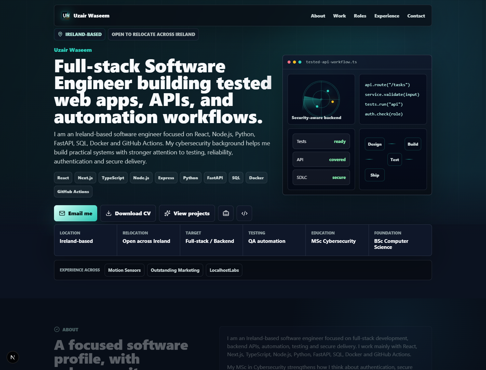

# Uzair Waseem - Engineering Portfolio

[](https://github.com/Assembler-Fourier/uzair-waseem-portfolio/actions/workflows/ci.yml)
[](https://uzairwaseem.com)
[](https://nextjs.org/)

Recruiter-focused portfolio for **Uzair Waseem**, a Dublin-based software engineer building full-stack products, backend APIs, QA automation, and security-aware delivery workflows.



## Reviewer Path

1. Open the [live portfolio](https://uzairwaseem.com) for the concise hiring overview.
2. Start with the privacy-safe [Roster Command demo](https://employee-roster-command.vercel.app/?demo=1).
3. Inspect [HouseFair](https://github.com/Assembler-Fourier/housefair-ai) for authenticated Next.js, PostgreSQL RLS, PWA, and Playwright work.
4. Inspect [Irish Theory Test Coach](https://github.com/Assembler-Fourier/irish-theory-test-coach) for serverless APIs, payments, accessibility, content QA, and explicit release gates.
5. Download the [one-page CV](https://uzairwaseem.com/Uzair-Waseem-CV.pdf).

## What This Repository Demonstrates

- Responsive Next.js App Router implementation with semantic HTML and keyboard-visible focus states.
- Compact case studies that link claims to live applications, source, tests, and current limitations.
- Search metadata, canonical URLs, Open Graph output, `Person` and `WebSite` JSON-LD, robots, and sitemap routes.
- A reproducible one-page PDF CV generator with stable legacy download URLs.
- Permanent `www` to apex-domain redirects and a Vercel production deployment.
- Reduced-motion support and custom CSS/SVG-style product visuals without stock project imagery.

## Architecture

```text
app/
  layout.tsx                 Global metadata and viewport configuration
  page.tsx                   Hiring page and structured data
  projects/[slug]/page.tsx   Evidence-led project case studies
  opengraph-image.tsx        Generated social preview
  robots.ts / sitemap.ts     Crawl configuration
public/                      Portrait, logo, CV, and static assets
scripts/generate_cv.py       Canonical CV generation and publishing
```

## Quality Gates

Pull requests and pushes to `main` run the same checks used locally:

```bash
npm ci
npm run check
```

`npm run check` runs TypeScript validation followed by a production Next.js build. The public site is also checked after deployment for route availability, redirects, console errors, responsive overflow, and downloadable CV delivery.

## Local Development

```bash
npm ci
npm run dev
```

Open `http://localhost:3000` and use `npm run check` before proposing changes.

## CV Generation

The downloadable CV is generated from `scripts/generate_cv.py`. It creates one canonical, single-column recruiter CV and copies it to the primary download path plus legacy role-specific URLs so older links remain valid.

```bash
python scripts/generate_cv.py
```

Generated PDFs are published under `public/` and served by the live site.

## Security

This repository contains no application secrets. See [SECURITY.md](SECURITY.md) for responsible reporting. Project pages distinguish public demos from private or pre-launch boundaries instead of presenting every build as production-ready.

## Contact

- Portfolio: [uzairwaseem.com](https://uzairwaseem.com)
- LinkedIn: [linkedin.com/in/uzair-waseem](https://www.linkedin.com/in/uzair-waseem/)
- GitHub: [github.com/Assembler-Fourier](https://github.com/Assembler-Fourier)
- Email: [uzairwaseem29@gmail.com](mailto:uzairwaseem29@gmail.com)
